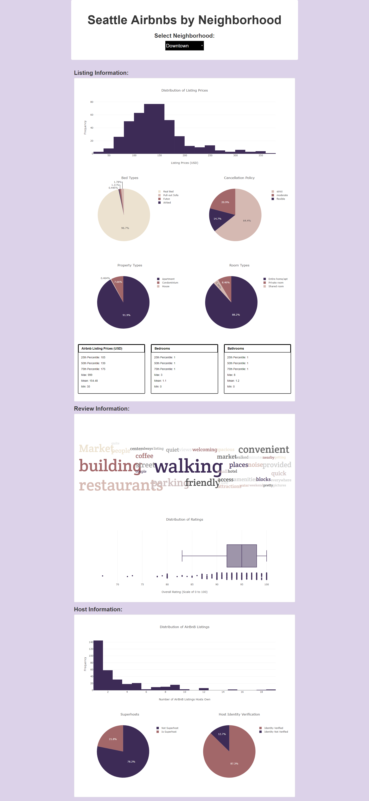
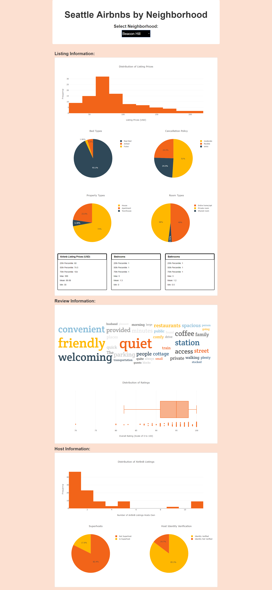

# Airbnb Dashboard
## Background Information
### Team Members
* Shannon Chang
* Madeleine Merken
* Miles Lucey
### Data Source
* MySQL database created in a past project. Follow this [link](https://github.com/mileslucey/Seattle_AirBnB_ETL) to see how we originally assembled the database
* The MySQL is adapted in this project to only include four Seattle neighborhoods (Queen Anne, Central Area, Downtown, and Beacon Hill) and then converted into a SQLite database
* The data is taken at a single point in time and includes 1,114 listings in total:
    * 245 Queen Anne listings
    * 318 Cemtral Area listings
    * 449 Downtown listings
    * 102 Beacon Hill listings
## Final Product
* See the deployed web application here: https://airbnb-dashboard-seattle.herokuapp.com/

